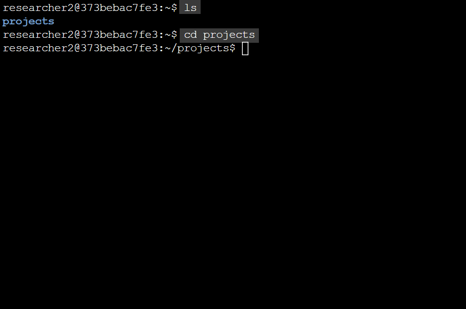
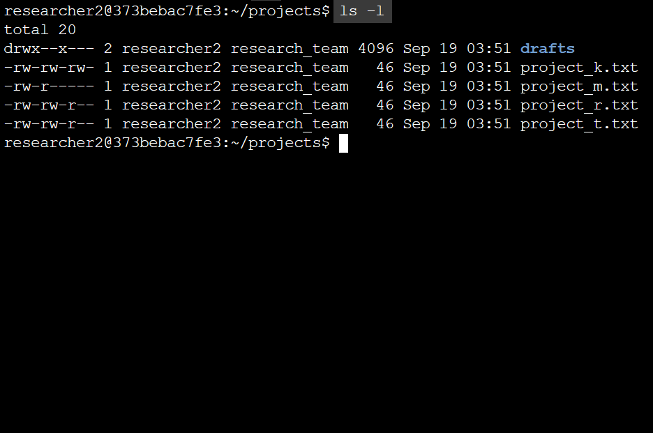
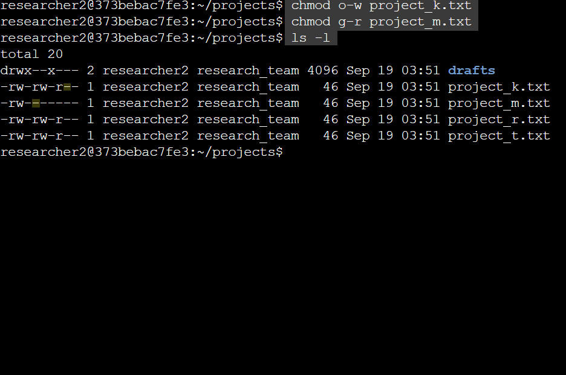
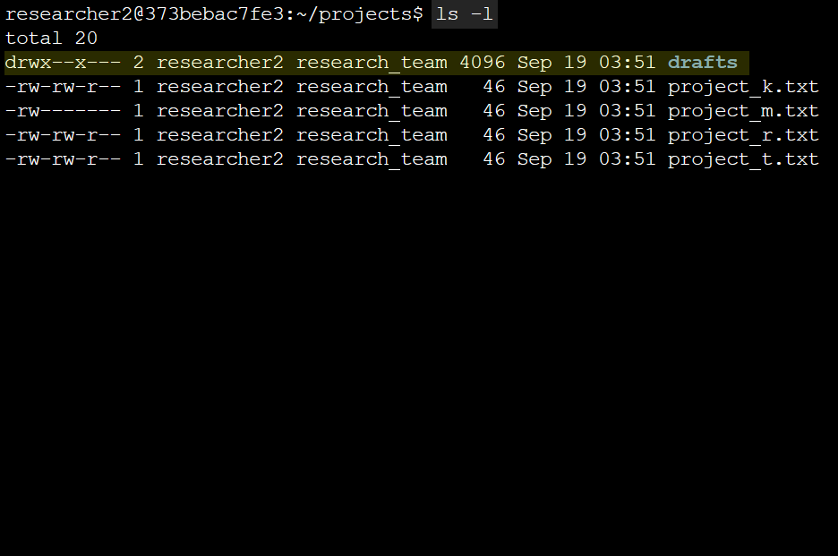
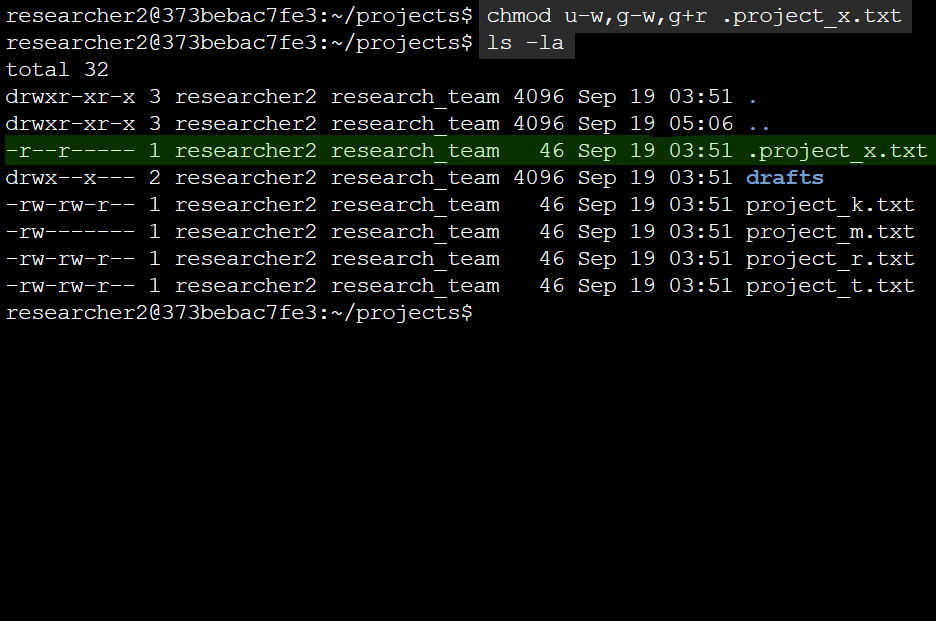
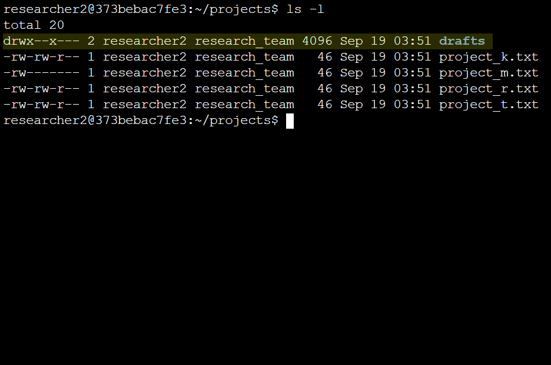
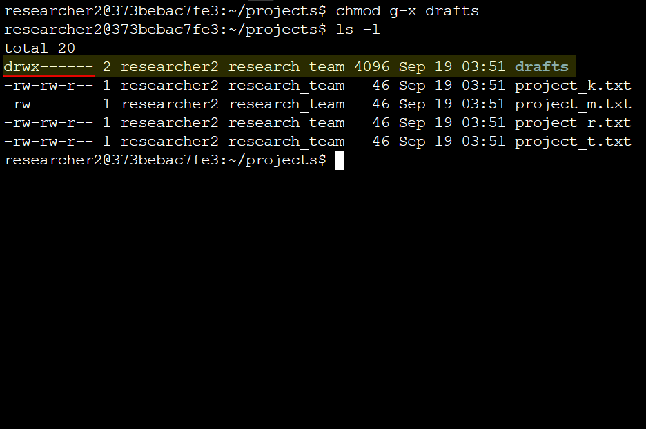

# linux-authperms
In this project, my **task** is to audit the permissions on the files in `/home/researcher2/projects` directory for the user named `researcher2`.
The user `researcher2` is part of the `research_team group`. My task was to ultimately check the permissions for all the files and directories (this includes hidden files).

I needed make sure to align the permissions with the authorization they have been granted. If they weren't identical, my objective was to change the permissions.
<br/>
<br/>
<br/>
<br/>


## Viewing File & Directory Details

```bash
# Listing all files

ls
```
```bash
# Changing the directory to projects with cd (change directory)

cd projects
```
<br/>
<br/>

<p align="center">
  
</p>
<br/>
<br/>
<br/>
<br/>

## Assessing the Permissions String

```bash
# To show available directories and view file permissions with '-l'

ls -l
```
<br/>
<br/>

<p align="center">
  
</p>
<br/>

Here I saw four files, and one directory.
The file type ```drafts``` is indicated by the first character, if it’s `d` its a directory, and if it has a hyphen (`-`), the default would be a file.
<br/>
<br/>
<br/>
<br/>

<p align="center">
  
</p>
<br/>
<br/>
<br/>
<br/>

I have **color coded** the permissions string for the `drafts` directory. The `User` permissions are yellow, `Group` permissions are green, and `Other` permissions are color coded in white.

- `r` = read  
- `w` = write  
- `x` = execute
<br/>
<br/>

The `User` owner has permissions to read, write, and execute, while the `Group` owner only has permissions to execute.
<br/>
<br/>
<br/>
<br/>

## Changing File Permissions
My **task** here was to audit file permissions, and to correct/manage them as needed.
In this scenario, I didn't want the `Other` group to be able to have write permissions, which is the last three hyphens (`-`) in the permission string. However, the `project_k.txt` file has a write permission for the `Other` group.
<br/>

I needed to change the permissions for this file with `chmod`. 
<br/>

```bash
# The 'o' in 'o-w' indicates the 'Other' group, while '-w' indicates a removal of the write permission.

chmod o-w project_k.txt
```
---

I also didn't want the `project_m.txt` file to be readable or writable by the `Group` or `Other`, I wanted only the `User` to be able to read and write the file. I decided to change the permissions with: 

```bash
chmod g-r project_m.txt
```
<br/>

Let’s check the results with `ls -l` again.
<p align="center">
  
</p>

<p align="center">
  <em>Note: I have highlighted what was changed in the permission strings for better understanding and visibility.</em>
</p>
<br/>
<br/>
<br/>
<br/>

## Changing File Permissions: _Hidden File_
My next **task** was to audit the permissions for a hidden file that was archived. This means that no one should be able to write on this file.
<br/>
<br/>

```bash
# Using ls -la will provide further details about hidden files
<br/>

ls -la
```
<p align="center">
  
</p>
<br/>
<br/>

The hidden/archived file is `.projects_tx.txt`, you can tell because it’s indicated with a `.` before the file name, and it also didn’t appear when I used `ls -l` earlier.

However, no one should be able to write on this file, the groups `User` and `Group` both have access to write on this file (when they should only have read permissions). I altered the permissions for `.prokect_x.txt` with the command:
<br/>
<br/>

```bash
# Removing 'User' and 'Group' permission to write, and add the read permission to 'Group'

chmod u-w,g-w,g+r .project_x.txt
```

```bash
# To check permissions of the hidden file again

ls -la
```

<p align="center">
  
</p>
<p align="center">
  <em>Success!</em>
</p>
<br/>
<br/>
<br/>

## Changing Directory Permissions
<p align="center">
  
</p>

My **last task** was to audit the permissions of the `drafts` directory so that the `Group` does not have permission to execute the directory. Only the user `researcher2` should be allowed access to `drafts`.
<br/>

```bash
# Removing the execute permission from 'Group'.

chmod g-x drafts
```
<br/>

<p align="center">
  
</p>
<p align="center">
  <em>Tasks completed!</em>
</p>
<br/>
<br/>
<br/>

## Summary
By auditing the file and directory permissions, I was able to ensure specific read, write, execute access to authorized users within the team. Unnecessary permissions for `Group` and `Other` users were removed, which lowered the potential vulnerabilities within the attack surface of the company, and strengthened the company's security posture. All changes in this lab project were made with the `chmod` command through Linux's Bash shell.
